# Methodology


## Design Choices & Justifications

| Design Choice | Justification |
|---------------|----------------|
| **Two separate pipelines:** <br> pipeline 1: tokenization and term aggregation,<br> pipeline 2: IDF, TF‑IDF, final stats calculation | - First pipeline builds a raw inverted index.<br>- Second pipeline computes document frequencies, IDF, and BM25 prerequisites without reprocessing raw text|
| **Intermediate output stored in `/tmp/indexer` (HDFS)** | Used because it was stated as an example |
| **Final output stored in `/indexer/`** | - All final data (index entries, vocabulary, document stats, collection stats) are kept in one HDFS directory to simplify retrieval.<br>- Special keys (`__VOCABULARY__`, `__DOC_STATS__`, `__COLLECTION_STATS__`) allow a single file set to hold everything needed for BM25 |
| **Vocabulary embedded as `__VOCABULARY__\tindex,term` inside final index files** | - No need for a separate file.<br>- Vocabulary is easily extracted by filtering lines starting with `__VOCABULARY__` |
| **Document stats stored as `__DOC_STATS__\tdoc_id,unique_terms,token_count,avg_term_freq`** | - Provides all per‑document length information required for BM25’s <br> length normalisation (doc length and avgdl).<br>- `avg_term_freq` is optional but useful for advanced scoring |
| **Collection stats stored as `__COLLECTION_STATS__\ttotal_docs:N`** | Single line gives total document count `N` needed for IDF calculation in BM25. |
| **Index entry format: `term\tdoc_freq,idf,doc:freq:tfidf,...`** | - Embeds document frequency and precomputed TF‑IDF.<br>- Still contains raw term frequency so BM25 can be recomputed with different `k1`/`b` parameters during query |


## Cassandra/ScyllaDB schema design choices

| Schema Decision | Justification |
|----------------|-------------------------------|
| **ScyllaDB instead of Cassandra** | ScyllaDB consumes significantly less memory. Simply inserting data into Cassandra was problematic on my machine since it requires at least 4 GB of RAM|
| **Four tables**: `vocabulary`, `inverted_index`, `document_stats`, `collection_stats` | Separates concerns: term metadata, posting lists, document lengths, and collection-wide stats. Meets assignment requirement for vocabulary, index, and BM25. |
| **`inverted_index` with `(term, doc_id)` PK** | Partition by `term` for fast single‑term queries (direct partition read). Clustering by `doc_id` allows ordered postings, which is core inverted index structure |
| **`document_stats` with `(doc_id)` PK** | O(1) lookup of document length (`token_count`) needed for BM25’s length normalization <br> factor (doc_len/avgdl) |
| **`collection_stats` as key‑value table** | Holds `total_docs` and `avg_doc_length`, which is essential for IDF (`log(N/df)`) and average document length |
| **`vocabulary` table with synthetic `term_id`** | Reduces storage overhead, numeric IDs enable future optimisations. Still supports lookup by `term` |


# Demonstration

Running should be done with docker-compose up -d.It is possible that issues related to memory allocation may come out during index creation. I personally had to add this into $HADOOP_HOME/etc/hadoop/yarn-site.xml:

```bash
<property>                                                                                                                                                                 
  <name>yarn.nodemanager.resource.memory-mb</name>                                                                                                                                    
  <value>2200</value>                                                                                                                                                                                                                                                 
</property>

<property>                                                                                                                                                                            
  <name>yarn.scheduler.minimum-allocation-mb</name>                                                                                                                                   
  <value>500</value>                                                                                                                                                                  
</property> 
```

## Indexing

### create_index.sh:

---
Command launch

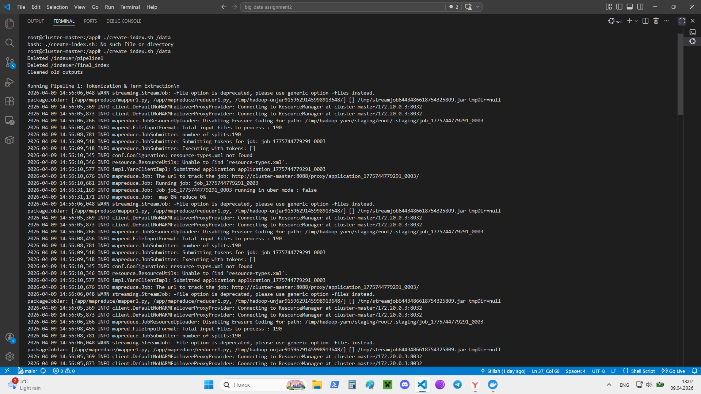

---
First mapreduce finished

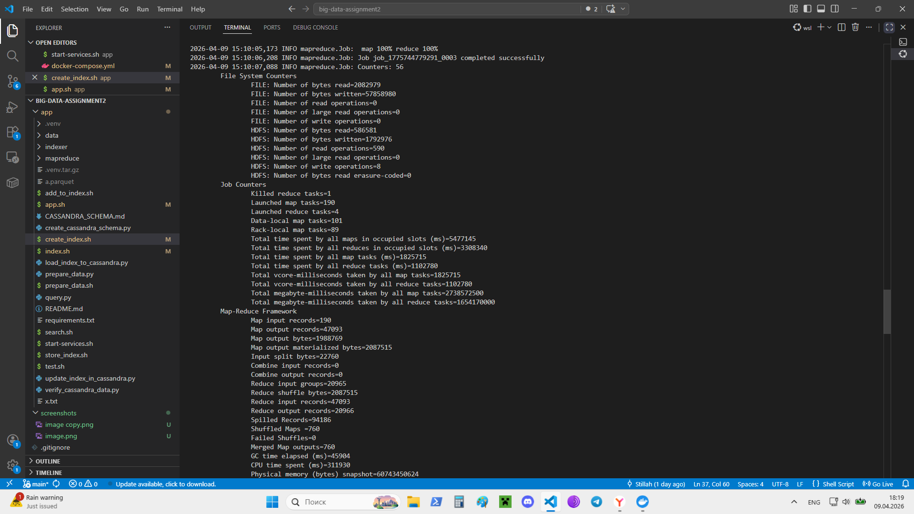

---
First mapreduce finished 2

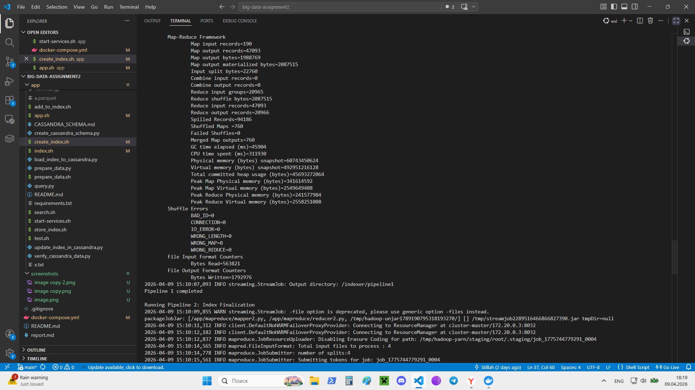

---
Second mapreduce finished

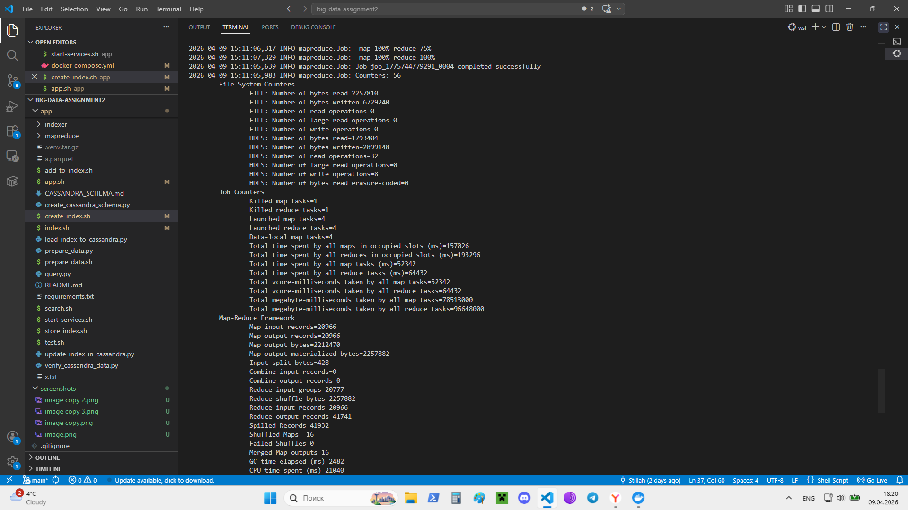

---
Script finished

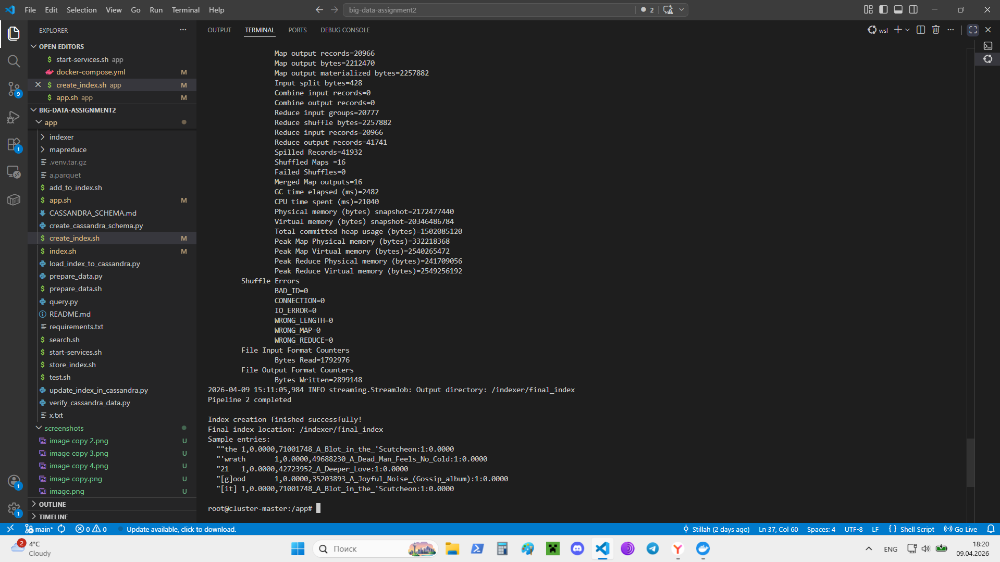


### store_index.sh:

---
Command launch

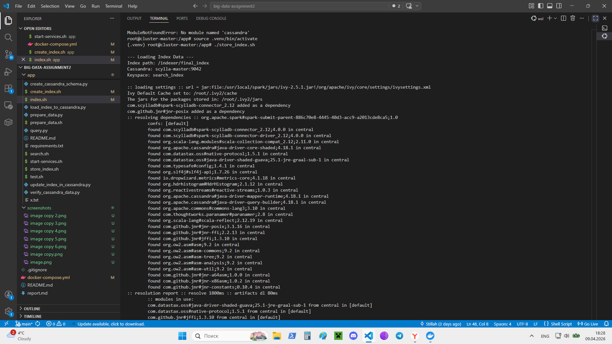


---
Script finished

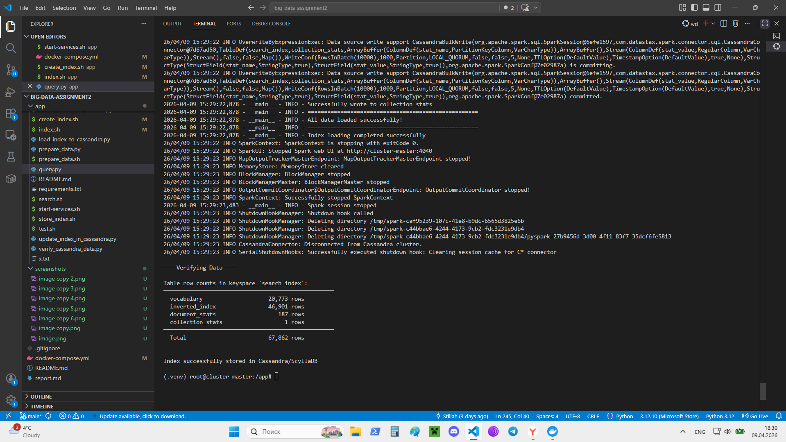


## Querying

---
Query 1 launch: "test query"

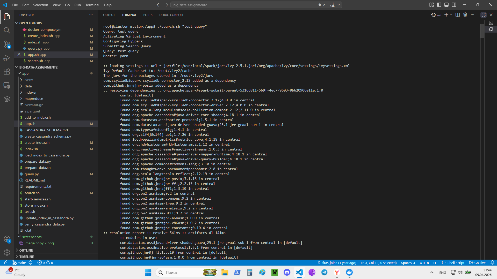

---
Query 1 result

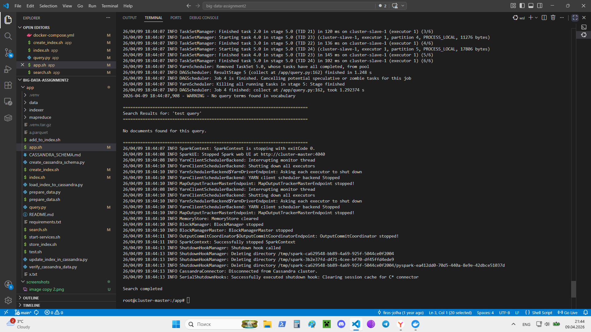


---
Query 2 launch: "i love big data"

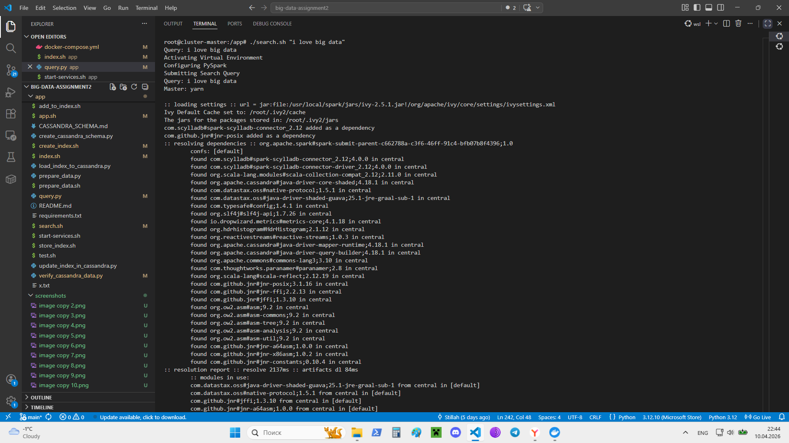

---
Query 2 result

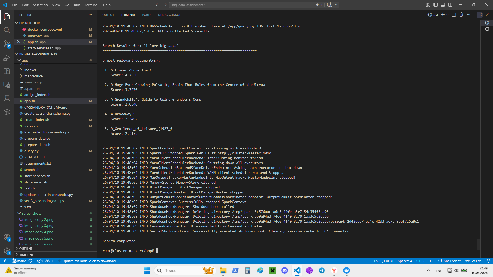


---
Query 3 launch: "please work"

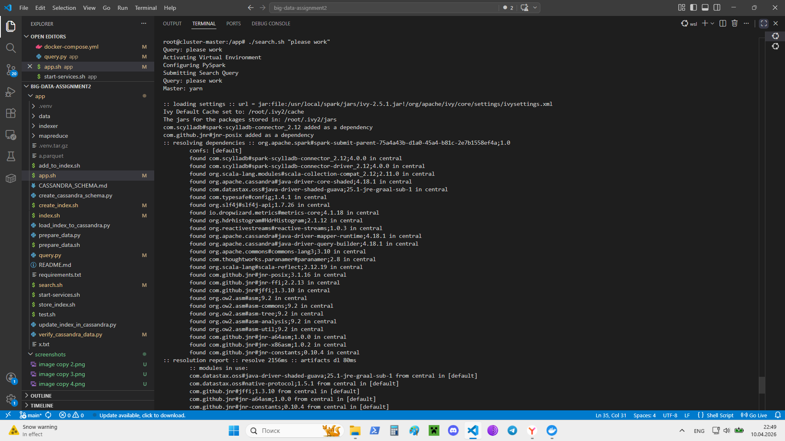

---
Query 3 result

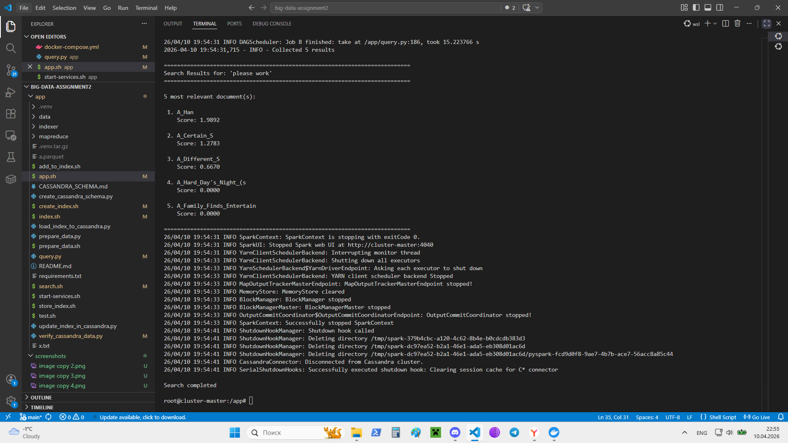

## Explainations:

### Query 1: "test query"
---
No documents in the collection contain any of the words 'test' or 'query'.

### Query 2: "i love big data"
---
The retrived documents contain at least some of the words. Most relevant documents are short and contain more of the rare, relevant to the query terms.

### Query 2: "please work"
---
3/5 of the retrived documents contain at least some of the words. Most relevant documents are short and contain more of the rare, relevant to the query terms.